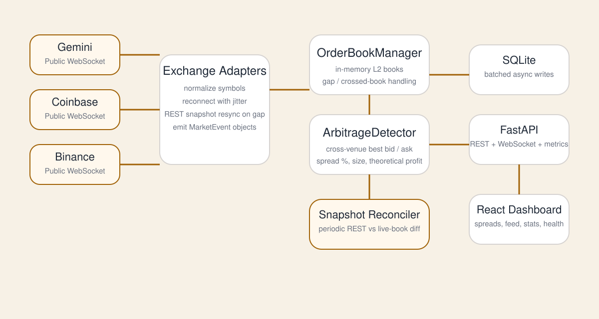

# ArbSync

ArbSync is a real-time, detection-only crypto arbitrage system. It consumes public
level-2 order books from Gemini, Coinbase, and Binance.US, normalizes each feed,
maintains trusted in-memory books, detects cross-exchange spreads, stores theoretical
opportunities in SQLite, and streams live state to a React dashboard.

No API keys are required. ArbSync does not place trades.



## What it demonstrates

- Concurrent WebSocket ingestion with exchange-specific reconnect and recovery logic
- Snapshot/delta sequencing and explicit book eligibility checks
- Event-driven arbitrage detection using `Decimal` prices and sizes
- Bounded persistence and dashboard queues so slow consumers do not block ingestion
- FastAPI REST, WebSocket, health, readiness, and Prometheus interfaces
- A React/TypeScript dashboard for spreads, feed health, opportunities, and statistics
- Fixture replay, property-based tests, synthetic benchmarks, and live-soak tooling

The default configuration tracks 9 assets on all 3 exchanges: 27 exchange/pair
subscriptions in total. See [`config.toml`](config.toml) for the exact symbols.

## How data moves through the system

```text
Exchange WebSockets
        |
        v
Exchange adapters  -- validate continuity and normalize messages
        |
        v
OrderBookManager   -- maintain L2 books and reject untrusted/stale state
        |
        v
ArbitrageDetector  -- compare eligible top-of-book prices
        |
        +----------> SQLite opportunity history
        |
        +----------> FastAPI WebSocket ----------> React dashboard
```

Recovery stays inside each exchange adapter because sequence semantics differ:
Binance.US aligns buffered deltas with a REST snapshot, Coinbase waits for a new
Level 2 stream snapshot, and Gemini reconnects for a new differential-depth snapshot.
The shared order-book module only accepts a continuous normalized stream.

## Run locally

Prerequisites:

- Python 3.11 or newer
- Node.js 20 or newer
- npm
- [uv](https://docs.astral.sh/uv/) for locked Python environments

From the repository root, create an environment and start the backend.

PowerShell:

```powershell
uv sync --locked --extra dev
uv run python -m arb.main
```

macOS/Linux:

```bash
uv sync --locked --extra dev
uv run python -m arb.main
```

The API listens on `http://127.0.0.1:8000` by default. In a second terminal,
start the dashboard:

PowerShell:

```powershell
cd dashboard
npm ci
npm run dev
```

macOS/Linux:

```bash
cd dashboard
npm ci
npm run dev
```

Open `http://localhost:5173`. During development, Vite proxies REST and WebSocket
traffic to the local backend. Set `VITE_API_URL` when the backend uses another origin;
[`dashboard/.env.example`](dashboard/.env.example) shows the expected format.

## Configuration

Runtime settings live in [`config.toml`](config.toml):

| Section | Controls |
| --- | --- |
| `detector` | Minimum spread percentage that emits an opportunity |
| `exchanges` | Exchange-native symbols to subscribe to |
| `server` | Bind address, port, and SQLite path |
| `persistence` | Batch size, flush interval, and bounded queue size |
| `order_books` | Maximum accepted age for otherwise trusted books |

Environment variables used by the application:

| Variable | Purpose | Default |
| --- | --- | --- |
| `ARB_LOG_LEVEL` | Backend log level | `INFO` |
| `VITE_API_URL` | REST origin used by the dashboard; its scheme is converted for WebSockets | Local Vite proxy in development; hosted API in production |

Restart the backend after changing `config.toml`.

## Useful interfaces

| Interface | Purpose |
| --- | --- |
| `GET /healthz` | Process liveness |
| `GET /readyz` | Adapter, book, and background-task readiness |
| `GET /api/adapters` | Connection age, reconnects, gaps, and last errors |
| `GET /api/book-status` | Eligibility and freshness for every configured book |
| `GET /api/opportunities/recent?limit=50` | Recent theoretical opportunities (`limit`: 1–500) |
| `GET /api/stats?window=1h` | Basic opportunity statistics |
| `GET /api/system/overview` | Uptime and all-time peaks |
| `GET /api/system/stats?window=1h` | Windowed aggregate statistics |
| `GET /api/system/timeseries?window=1h&bucket_seconds=60` | Chart buckets (`bucket_seconds`: 1–86,400) |
| `GET /metrics` | Prometheus exposition |
| `WS /ws/live` | Initial state followed by live book/status/opportunity messages |

FastAPI's interactive schema is available at `http://127.0.0.1:8000/docs` while
the backend is running. Nanosecond timestamps are serialized as decimal strings so
JavaScript clients do not lose integer precision.

## Verify a change

Run backend checks from the repository root:

```powershell
uv run pytest -q server/tests
uv run mypy --strict server/arb
uv run ruff check server
uv run ruff format --check server
```

Install or run the same cross-platform checks as Git hooks:

```powershell
uv run pre-commit install
uv run pre-commit run --all-files
```

Run frontend checks from `dashboard/`:

```bash
npm run typecheck
npm run lint
npm run build
```

The repository currently has 150 passing backend tests. CI runs tests with coverage,
strict type checking, linting, and the production dashboard build.

## Benchmarks and replay

The committed synthetic results are hardware-specific and do not represent live
exchange or network performance.

| Path | p50 | p95 | Throughput |
| --- | ---: | ---: | ---: |
| Detector only | 3.42 us | 3.88 us | 16,454,491 evaluations/min |
| Synthetic ingest-to-detection | 16.00 us | 17.33 us | 1,920,581 events/min |

Reproduce them from the repository root:

```powershell
python tools/benchmark.py
python tools/bench_e2e.py --iterations 10000
python tools/replay.py server/tests/fixtures/recorded
```

See [`docs/BENCHMARKS.md`](docs/BENCHMARKS.md) for methodology and
[`artifacts/benchmarks/results.json`](artifacts/benchmarks/results.json) for the
committed raw results.
The live observer is documented there as well; the repository includes short smoke
runs, but not yet the planned 24-hour soak.

## Repository map

```text
server/arb/          Backend modules
  adapters/          Gemini, Coinbase, and Binance.US feed adapters
  api.py             HTTP/WebSocket interfaces and live broadcasting
  orderbook.py       L2 state and the canonical eligibility decision
  detector.py        Cross-exchange spread calculation
  persistence.py     Batched SQLite writes and statistics queries
  reconcile.py       Periodic live-versus-REST comparison
  main.py            Application wiring and task supervision
server/tests/        Unit, property, replay, and pipeline tests
dashboard/src/       React/TypeScript dashboard
tools/                Benchmark, replay, profiling, and soak utilities
artifacts/benchmarks/ Machine-readable results and live-run artifacts
docs/BENCHMARKS.md   Benchmark and soak methodology
docs/RESYNC.md       Current recovery design decision
docs/VALIDATION.md   Verified behavior and remaining validation evidence
var/                  Ignored local database, logs, and temporary files
```

## Scope and limitations

Every reported opportunity and profit value is theoretical. Calculations exclude
trading and withdrawal fees, slippage, transfer latency, inventory constraints,
partial fills, rate limits, and execution risk. The detector uses only top-of-book
liquidity and is an observability project, not an execution engine or trading system.

The largest remaining validation gap is a documented 24-hour live soak covering
memory stability, reconnect recovery, sequence gaps, and the 60-second freshness
threshold.
